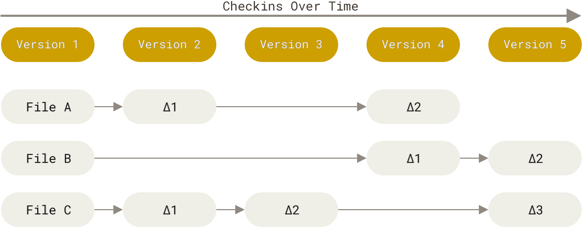
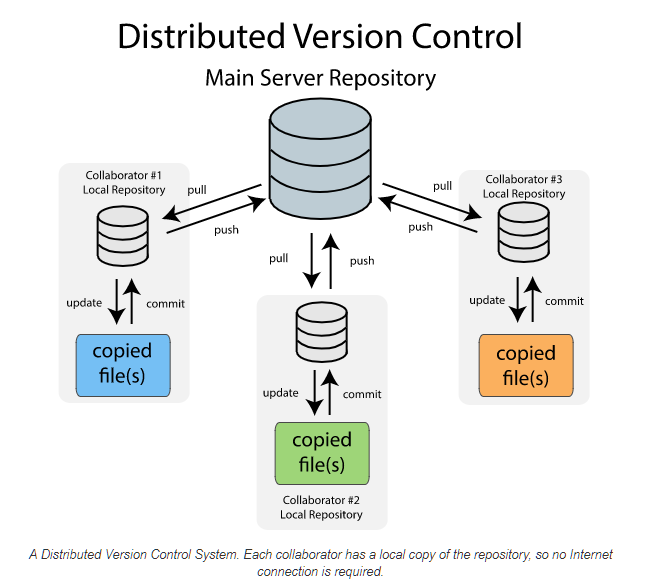
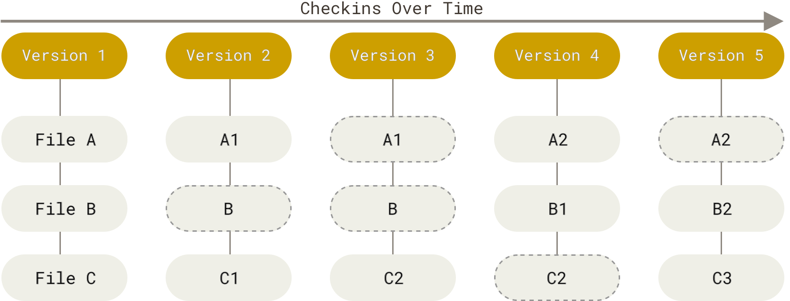
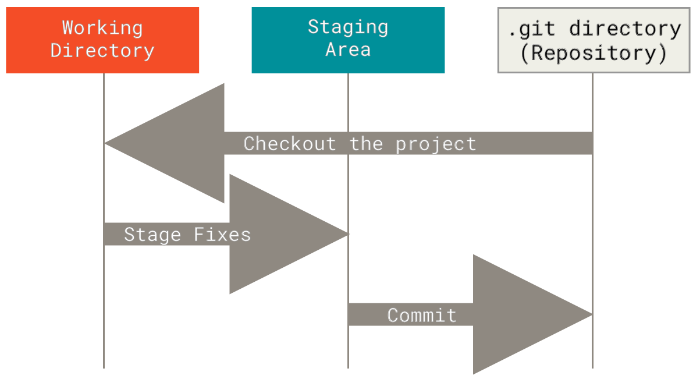
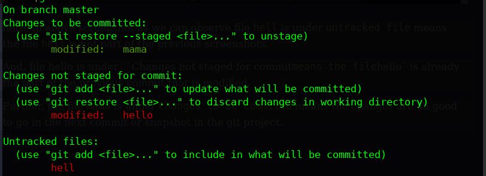
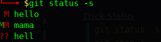
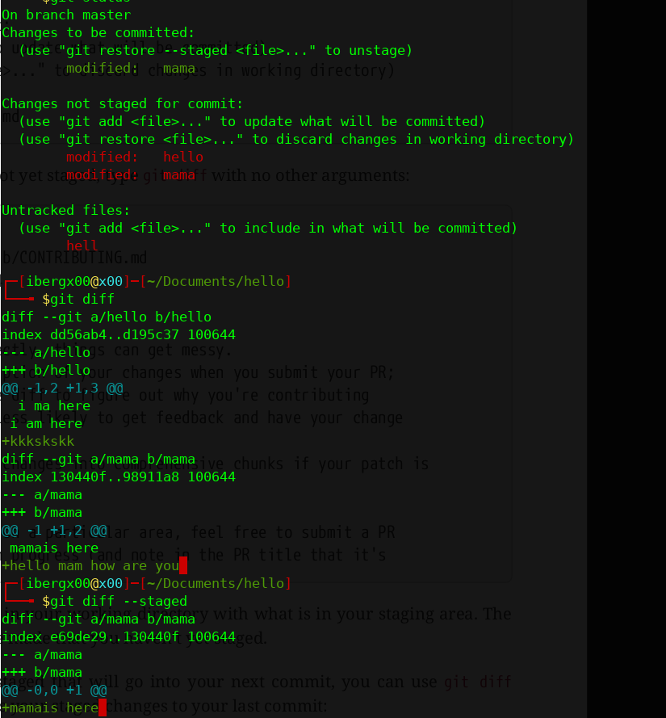

 <div align="center">
    <a href="#"></a>
    <br/>
</div>

***

# Introduction
Before we learn about `git`, let us get familier with `Version Control System`. Nowadays, every one is talking about git and it amazing features that helps overcoming the manual works of tracking down history/version our project.
<br/>
<br/>
 Let's learn about `Version Control System` aka `VCS`. 
 Let me finsh the VCS in follow points:
<br/>
- what is it?
- why it exists?
- what reason of its existence?
<br/>

Lets break down the word `Version Control System` into 

- Version ---> The state or the snapshot of particular instance of time of any matter.
- Control ---> A mechanism {[a sort of ]}(#) that controls and manage the version history. 
- System ---> We all know the organized or not sort of organized functioning being that combines above `TWO keyword` to work as a fully functioning as single unit.

Now, let's talk about the `Version Control` ie,
```
The practice of tracking down or mapping the every change a developer made to a project from the begining to end of the project, Actually a project is not considered as finished. [About tools we will further look into in couple of minutes. OK]
```
<br>

Further, the VCS is of actually three types:
- Local Version Control Systems
- Centralized Version Control Systems
- Distributed Version Control Systems
<br/>

***

<h1 style="border:0;font-weight:bold" align="center">Local Version Control Systems</h1>

```
In simple terms, Local version control system is a local database located on our PC. Let me elaborate it, In this Version control System, every thing is manually managed (some user uses timestamp directory to map the history)
but this lead to high probabilty of forgetting or misunderstanding about the history or version of the project.
```

 <div align="center">
    <a href="#"></a>
    <br/>
</div>
<br/>
Actually, the LVCS works on the top of Revison Control System or a sort of implements it ok.

A little about `Revision Control System` 

```
The Revision Control System (RCS) manages multiple revisions of files. RCS automates the storing, retrieval, logging, identification, and merging of revisions.
```
Using RCS mechanism, every change made is stored as `patch`, the collection are termed as `patch set` which are stored in specific format in disk like `stack` datastructure.
<br/>

* *What is patch?* <br>
--> the difference between same file's version or state.

**Visusally**<br>
Version 1:
File 1:
* Hello world!<br/>

Version 2:
File 1:

* HELLO WORLD!
* new to git.

<br>
Difference between the version of file 1 is:

```
HELLO WORLD!
new to git.

```

<div align="center">
    <a href="#"></a>
    <br/>
</div>

<br/>
<br/>

**`patch set` equivalent to `Stack` like a stack of patches.**
Using RCS mechanism, it can then re-create what any file looked like at any point in time by merging up all the patches then we can get the full version of the project at that instance of time.

<br/>

***

<h1 style="border:0;font-weight:bold" align="center">Centralized Version Control Systems</h1>

Due to lack of collabaration in `LVCS`, Centralized Version Control Systems are introduced. The most well-known examples of centralized version control systems are Microsoft Team Foundation Server (TFS) and SVN.

<div align="center">
    
    <br/>
</div>
<br>

A centralized version control system has a single server that contains all the file versions. This enables multiple clients to simultaneously access files on the server, pull them to their local computer or push them onto the server from their local computer. This way, everyone usually knows what everyone else on the project is doing.
`Administrators have control over who can do what.`

The biggest `issue` with this structure is that everything is `stored on the centralized server`. If something went wrong with server, nobody can save their versioned changes, pull files or collaborate at all. If server get corrupted, you lose the entire history of the project except whatever single snapshots people happen to have on their local machines.

<br/>

***

<h1 style="border:0;font-weight:bold" align="center">Distributed Version Control Systems</h1>

In a `Distributed Version Control Systems` (such as Git, Mercurial,
Bazaar or Darcs), clients don’t just check out the latest snapshot of the files also, they fully mirror the repository, including its full history. Every clone is really a `full backup` of all the data for Developer and Server.

<div align="center">
    
    <br/>
</div>
<br>

Here, developer can collaborate with different groups of people in different ways simultaneously within the same project [usually with issue tab].

<h1 style="border:0;font-weight:bold, font-size:10" align="center">Git Brief History</h1>
The disput between `Linux Foundation` and `BeeKeeper` [DVCS] give birth our Distributed Version Control System tool ie, `GIT` in 2005. 

**Why GIT?**
```
Delta-based version control ----> used by other VCS ie, the storing of information as a list of file-based changes.
```
<div align="center">
    <a href="#"></a>
    <br/>
</div>
<br/>

*BUT WITH GIT*
```
Git treat the data as stream of Snapshots. When we save or commit our changes, Git took snapshot of the project of that particular instance of the time and returns a reference to that snapshot, To be more precisely it doesn't store the unchanged/unmodified files again; instead GIT refer a link to the previously stored file. 
```

*Insight of Git internal mechanism in context of snapshots* 
- [marryblog](https://maryrosecook.com/blog/post/git-from-the-inside-out)
- [stacky](https://stackoverflow.com/questions/8198105/how-does-git-store-files)

<div align="center">
    
    <br/>
</div>
<br>
<br>

**Some stuff about Git**

```

CheckSum --> A mathematical value created using a cryptographic algorithm that is assigned to data and later used to test the data to verify that the data has not changed.s

Git's checksums include meta data about the commit including the author, date, and the previous commit's SHA. Git assures the integrity of the data being stored by using checksums as identifiers.

```

Everything in Git is checksummed before it is stored and is then referred to by that checksum due to why it is impossible to happen smthg without git knowing about it.

Checksumming mechanism used by GIT is called a SHA-1 hash. This is a 40-character string[160 bit] composed of 0x characters (0–9 and a–f) and calculated based on the file's content or dir. structure in Git.

***

## **Sections of Git Project**

- **Working Directory**
- **Staging Area**
- **.git Repository**

<div align="center">
    
    <br/>
</div>
<br>

***

<h1 style="border:0;font-weight:bold, font-size:10" align="center">Git WorkFlow! </h1>


<div align="center">
    
    <br/>
</div>
<br>

***

|Working Directory| Staging Area| Local Repository|
| :---: | :---: | :---: |
| All the required changes made to the files | git add `<file name> ` | git commit |
    

<br>

<div align="center">
    
    <br/>
</div>
<br>

## **States of Files**

### - **Tracked**
```
Git knows of it. like file in staging area and files those were present in the last commit or snapshot. They can be unmodifed, modified and staged.
```

>And, file hello is under ``Changes not staged for commit` means the file `hello` is already the part of the previous commit that is modified.

> Further, the file `mama` is under `Changes to be commited` means the changes are all good to go in the next commit or snapshot in the git project.


### - **Untracked**

```
Git doesn't knows of it. like files those are not present in last commit of the git project, these files in unstaged area.
```

>here, in above screenshot as we can observe file `hell` is under `untracked file` means the file `hell` is not part of the previous snapshots. 

<br>
<u>Trick-Status</u>

>`git status -s`<br>
>`git status --short`


<br>
***

|`git status `|`git diff`| `git diff --staged` / `git diff --cached` |
|:---:|:---:|:---:|
|provides the inwhich state the file is residing |provides insight of the modified unstaged tracked files |provides insight of the modified staged flies |


***

## **Unstaging the staged files**

